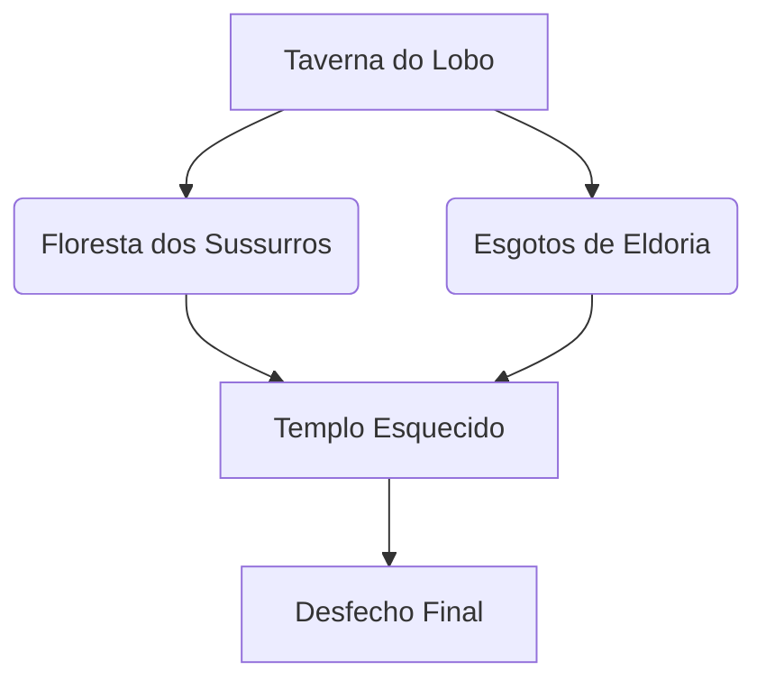

# **📜 Aventura Digital: A Maldição de Lysara**  
*Um jogo de narrativa interativa com múltiplos finais*  


---

## **🎮 Visão Geral**  
**Aventura Digital** é um jogo de escolhas narrativas onde suas decisões moldam o destino do reino de Eldoria. Com:  
- 🌟 **12+ finais diferentes** baseados em suas escolhas  
- 🏆 **Sistema de reputação** com 3 facções influentes  
- 🧩 **40+ cenas interativas** com quebra-cabeças e diálogos dinâmicos  
- ⚔️ **Combate estratégico** usando habilidades e itens especiais  

**Licença:** Creative Commons CC-BY-SA *(Liberdade para usar e modificar, com atribuição)*  

---

## **🚀 Começando**  

### **Pré-requisitos**  
- Node.js 16+  
- npm/yarn  
- React 18+  

### **Instalação**  
```bash
git clone https://github.com/seu-usuario/aventura-digital.git
cd aventura-digital
npm install
npm run dev
```

---

## **🌌 Mundo do Jogo**  

### **Personagens Principais**  
| **NPC**          | **Descrição**                          | **Alinhamento** |  
|------------------|----------------------------------------|----------------|  
| **Kael**         | Seu irmão desaparecido                 | ???            |  
| **Lysara**       | A deusa traidora                       | Caótico Maligno|  
| **Gareth**       | Caçador de recompensas                 | Neutro         |  

### **Locais Importantes**  


---

## **🎛️ Mecânicas Principais**  

### **1. Sistema de Reputação**  
```javascript
// Exemplo de código
function updateReputation(faction, value) {
  gameState.reputation[faction] += value;
  if (gameState.reputation[faction] >= 10) unlockSpecialEnding();
}
```

### **2. Itens Especiais**  
| **Item**               | **Efeito**                     | **Onde Encontrar**          |  
|------------------------|--------------------------------|----------------------------|  
| Amuleto de Lysara      | Revela diálogos secretos       | Templo Esquecido           |  
| Adaga do Espectro      | +5 dano (custa 1 vida por uso) | Missão "Assombração Noturna"|  

### **3. Árvore de Decisões**  
```typescript
interface Choice {
  text: string;
  nextScene: string;
  required?: {
    item?: string;
    skill?: "persuasion" | "lore";
    reputation?: Record<string, number>;
  };
  effects?: {
    addItem?: string;
    reputationChange?: Record<string, number>;
  };
}
```

---

## **📂 Estrutura de Arquivos**  
```
/public
  /assets
    backgrounds/
    characters/
    music/
/src
  /components
    GameScreen.tsx
    ChoiceButton.tsx
  /pages
    api/
      story.ts       # Endpoint da narrativa
      types.ts       # Tipos TypeScript
  /styles
    globals.css
    game-page.css
```

---

## **✨ Recursos Criativos**  

### **Arte Conceitual**  
- [Baixar assets CC0](https://opengameart.org) *(Links para recursos gratuitos)*  

### **Trilha Sonora**  
```javascript
// Como tocar música condicional
if (currentScene === "finalBattle") {
  playMusic("epic_battle.mp3");
}
```

---

## **🧪 Testando**  
Execute todos os finais com:  
```bash
npm run test:endings
```  
*Verifique o arquivo `cypress/integration/endings.spec.js`*

---

## **🤝 Como Contribuir**  
1. Faça um fork do projeto  
2. Crie sua branch (`git checkout -b feature/incrivel`)  
3. Commit suas mudanças (`git commit -m 'Adiciona novo final'`)  
4. Push para a branch (`git push origin feature/incrivel`)  
5. Abra um Pull Request  

**Guias úteis:**  
- [Adicionando novas cenas](docs/ADDING_SCENES.md)  
- [Criando finais especiais](docs/ENDINGS.md)  

---

## **📜 Licença**  
Este projeto está sob **Creative Commons Attribution-ShareAlike 4.0**  
[](https://creativecommons.org/licenses/by-sa/4.0/)

---

## **📮 Contato**  
**Autores:** Vinícius Nishimura Reis & Felipe Yamaschita    

*"Toda escolha tem consequências..."* 🌑
